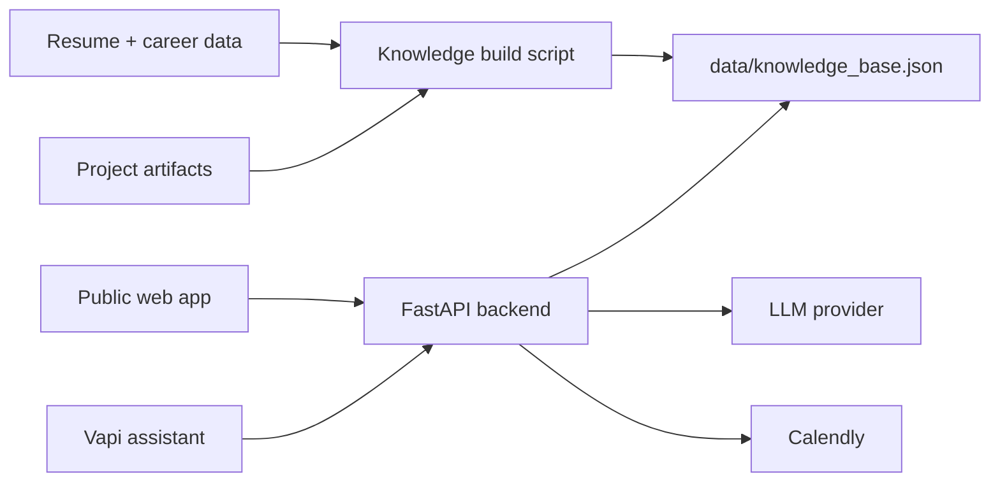

# Adarsh AI Persona

Live AI persona for the Scaler screening assignment.

This project exposes:
- a public chat UI grounded on Adarsh Singh Tomar's real resume and project artifacts
- a live voice agent number configured through Vapi
- a real booking flow through Calendly
- a shared backend for chat, booking, and voice configuration

## Live Links

- Chat: `https://scaler-persona.vercel.app`
- Voice agent: `+1 857 269 2436`
- Booking: `https://calendly.com/adarshsinghtomar7909043383/new-meeting`
- Eval report: `https://scaler-persona.vercel.app/static/evals-report.pdf`

## What Works

- Public chat answers questions about:
  - fit for the role
  - resume details
  - RAG experience
  - GitHub projects and tradeoffs
- Voice agent introduces itself as Adarsh's AI representative and handles spoken Q&A
- Booking is live and confirmed through Calendly
- `/api/voice/config` exposes the voice prompt and current live phone number

## Architecture



## Repository Layout

- `app/`
  FastAPI app, persona logic, booking logic, LLM client, retrieval
- `static/`
  Public frontend for chat, booking CTA, and voice CTA
- `data/`
  Generated knowledge base used for grounding
- `scripts/`
  Knowledge build and local demo-video utilities
- `reports/`
  Evaluation report and demo artifacts
- `tests/`
  Smoke tests for health, webhook, booking, and voice config

## Core Endpoints

- `GET /`
  Public app
- `POST /api/chat`
  Grounded chat response
- `GET /api/availability`
  Current booking handoff details
- `POST /api/book`
  Booking action surface
- `GET /api/voice/config`
  Voice assistant configuration
- `POST /webhook`
  Messaging/voice webhook entrypoint
- `GET /health`
  Health check

## Local Setup

1. Create `.env`
2. Install dependencies
3. Run the app

```bash
cd /Users/adarsh/scaler-persona
python3 -m venv .venv
source .venv/bin/activate
pip install -r requirements.txt
uvicorn app.main:app --reload --port 8000
```

Open:

`http://127.0.0.1:8000`

## Environment Variables

Important variables used by the app:

```env
LLM_PROVIDER=openrouter
OPENROUTER_API_KEY=
OPENROUTER_MODEL=liquid/lfm-2.5-1.2b-instruct:free

CALENDLY_URL=https://calendly.com/adarshsinghtomar7909043383/new-meeting
CALENDLY_SPOKEN_PATH=calendly dot com slash adarshsinghtomar7909043383 slash new-meeting
VAPI_PHONE_NUMBER=+1 857 269 2436
```

## Voice Setup

The live voice path is currently configured in Vapi.

Recommended voice behavior:
- introduce as Adarsh's AI representative
- answer resume and project questions honestly
- use the spoken Calendly path for scheduling

The backend mirrors this through:
- `GET /api/voice/config`

## Running Tests

```bash
cd /Users/adarsh/scaler-persona
pytest -q
```

## Demo Flow

1. Open the public app
2. Ask role-fit or project questions in chat
3. Open the booking page
4. Call the live Vapi number

## Notes

- Booking is intentionally handled through Calendly for reliability
- Voice is powered by Vapi with a live phone number
- The app is optimized for the Scaler submission demo rather than a general-purpose production product
