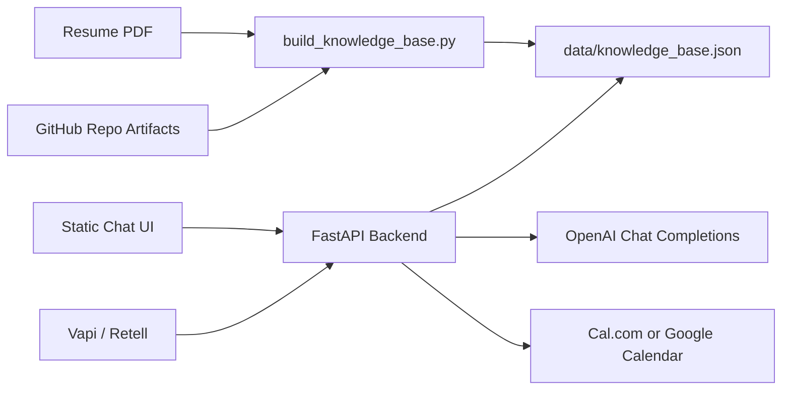

# Adarsh AI Persona

Public chat persona and voice-agent backend for the Scaler screening assignment. The system is grounded over Adarsh Singh Tomar's real resume plus local GitHub project artifacts, and exposes shared APIs for chat, availability lookup, and interview booking.

## What It Covers

- Public chat UI at `/`
- RAG-backed answers over actual resume and repo material
- Voice-agent config surface at `/api/voice/config` for Vapi or Retell
- Real booking adapters for Cal.com or Google Calendar when credentials are provided
- Eval report source in [reports/evals-report.md](reports/evals-report.md)

## Architecture



## Grounding Sources

- Resume extracted from `~/Downloads/AdarshResNew.pdf`
- `Computer-Vision-Powered-Search-Application`
- `Meta-Hackathon`
- `FixForge`

The app answers from the generated knowledge base, not from hardcoded strings in the UI.

## Local Run

1. Create an env file and set at least `OPENAI_API_KEY`.
2. Optional: add either Cal.com or Google Calendar credentials for real booking.
3. Rebuild the corpus:

```bash
python3 scripts/build_knowledge_base.py
```

4. Start the server:

```bash
uvicorn app.main:app --reload --port 8000
```

5. Open `http://127.0.0.1:8000`.

## API Surface

- `POST /api/chat`
- `GET /api/availability`
- `POST /api/book`
- `GET /api/voice/config`
- `GET /health`

## Voice Setup

Use `/api/voice/config` as the source of truth for the assistant prompt and tool endpoints.

Recommended production wiring:

1. Create a Vapi or Retell assistant.
2. Use the system prompt and first message from `/api/voice/config`.
3. Register tool or webhook calls to:
   - `/api/chat`
   - `/api/availability`
   - `/api/book`
4. Attach a Twilio or platform-native phone number.

## Booking Providers

### Cal.com

Set:

- `CALCOM_API_KEY`
- `CALCOM_EVENT_TYPE_ID`
- `CALCOM_TIMEZONE`

### Google Calendar

Set:

- `GOOGLE_ACCESS_TOKEN`
- `GOOGLE_CALENDAR_ID`

## Tests

```bash
pytest
```

## Submission Notes

This repo is deployment-ready, but public hosting, phone provisioning, and end-to-end booking confirmation still require valid provider credentials in the target environment.
